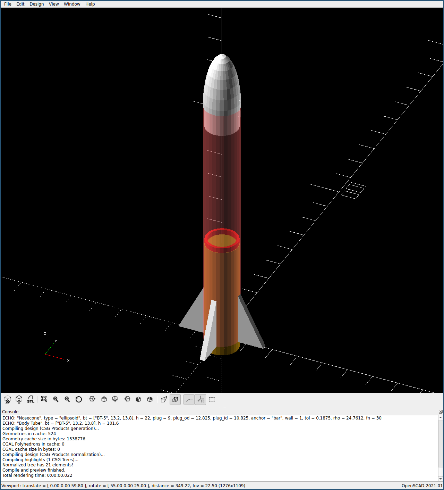

# Rocketship Games' OpenSCAD Rocket Tools

## Install

Download and add the root folder to the library paths listed in your
`OPENSCADPATH` environment variable, e.g.:

```
export OPENSCADPATH=/home/joe/rocketshipgames/rockets/openscad
```

## Example

```
include <rockettools.scad>

bt = bt_get("BT-5");
eng = e_get("13mm");
h = u_inches(4);

echo(bt=bt, eng=eng, h=h);

color("White")
translate([0, 0, h])
nc_nosecone(NC_ELLIPSOID, bt, 22);

color("Red")
translate([0, 0, eng[E_LEN]-4])
  e_block(bt);

color("White")
for (i = [0:3])
  rotate([0, 0, i*90])
    translate([bt[BT_OUTER]/2, 0, 0])
    s_right_triangle([10, 2, 20]);

translate([0, 0, -4])
  e_engine(eng);

#bt_bodytube(bt, h);
```


